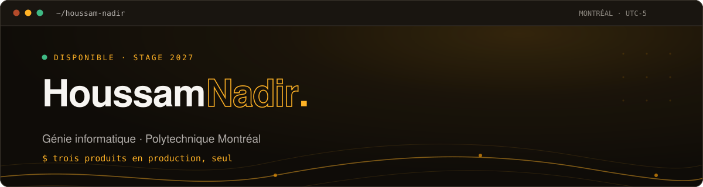

  

 

   

---

<h3>&nbsp;🇫🇷&nbsp;&nbsp;Français</h3>

 

Étudiant en **génie informatique à Polytechnique Montréal**, diplômé en déc. 2027.
J'expédie des produits complets, seul : pipelines LLM à sorties structurées, scoring
déterministe, comptabilité transactionnelle sans course, sécurité cloud.

Trois principes, tenus dans les trois produits :

| | |
|:--|:--|
| **Le modèle extrait, le code décide** | Un LLM reformule et classe. Chaque chiffre montré à l'utilisateur sort d'une fonction pure, reproductible. |
| **Un invariant non testé n'existe pas** | Les règles produit descendent au niveau du test : elles échouent la CI au lieu de dormir dans un document. |
| **La contrainte d'exécution est une contrainte de conception** | Le timeout d'une Lambda, le débit d'un fournisseur : des paramètres d'architecture, pas des accidents. |

#### En production

Ces trois produits tournent réellement. Leur code est privé — les liens pointent vers les applications elles-mêmes.

<table>
<tr>
<td width="33%" valign="top">

**[Carriv](https://carriv.com)** &nbsp;`en prod`

Adapte un CV à une offre sous une règle de zéro invention inscrite dans chaque prompt. Le score ATS est une fonction déterministe, pas une sortie de modèle.

`~30 s` par génération
`SvelteKit 2` · `MongoDB` · `Stripe`

</td>
<td width="33%" valign="top">

**[StudyLumina](https://app.studylumina.com)** &nbsp;`en prod`

Mesure la préparation réelle à un examen, chapitre par chapitre. Chaque réponse est citée (document et page). Aucune note produite par un LLM.

`47 600` lignes TS · `74` fichiers de tests
`Next.js 15` · `pgvector` · `BullMQ`

</td>
<td width="33%" valign="top">

**[Sanade](https://sanade.app)** &nbsp;`en prod`

Suivi d'habitudes qui arbitre au lieu d'enregistrer : deux ou trois objectifs tenables par jour, et la raison de chaque écart.

`62 000` lignes TS · `941` tests
`Expo` · `tRPC` · `Turborepo`

</td>
</tr>
</table>

#### Code public

<table>
<tr>
<td width="50%" valign="top">

**[triage](https://github.com/Houssam2510/triage)** &nbsp;`Python` `MIT`

Priorisation de vulnérabilités par le risque réel : corrèle les résultats Trivy avec CISA KEV, FIRST EPSS et NVD pour trier ce qu'il faut corriger d'abord.

</td>
<td width="50%" valign="top">

**[e2ee-messenger-protocol](https://github.com/Houssam2510/e2ee-messenger-protocol)** &nbsp;`TypeScript` `MIT`

Protocole de messagerie E2EE réimplémenté de zéro : X3DH + Double Ratchet, relais zero-knowledge.

</td>
</tr>
<tr>
<td valign="top">

**[Portfolio](https://github.com/Houssam2510/Portfolio)** &nbsp;`TypeScript`

Le code de [houssam-nadir.me](https://houssam-nadir.me). Next.js 16, tokens `oklch()`, fond en canvas, zéro framework CSS.

</td>
<td valign="top">

**[htmlToMp4](https://github.com/Houssam2510/htmlToMp4)** &nbsp;`JavaScript`

Convertit une animation HTML/CSS/JS en MP4 vertical 1080×1920 via Puppeteer, sans déformation.

</td>
</tr>
</table>

<h3>&nbsp;🇬🇧&nbsp;&nbsp;English</h3>

 

**Computer engineering student at Polytechnique Montréal**, graduating Dec. 2027.
I ship complete products on my own: structured-output LLM pipelines, deterministic
scoring, race-free transactional accounting, cloud security.

Three principles, held across all three products:

| | |
|:--|:--|
| **The model extracts, the code decides** | An LLM rephrases and classifies. Every number shown to a user comes out of a pure, reproducible function. |
| **An untested invariant does not exist** | Product rules live at the test level: they fail CI instead of sitting in a document nobody rereads. |
| **Runtime constraints are design constraints** | A Lambda's timeout, a provider's rate limit: architecture parameters, not accidents to absorb in production. |

#### In production

All three products are live. Their source is private — the links point to the applications themselves.

<table>
<tr>
<td width="33%" valign="top">

**[Carriv](https://carriv.com)** &nbsp;`live`

Tailors a résumé to a job posting under a zero-fabrication rule written into every prompt. The ATS score is a deterministic function, never a model output.

`~30 s` per generation
`SvelteKit 2` · `MongoDB` · `Stripe`

</td>
<td width="33%" valign="top">

**[StudyLumina](https://app.studylumina.com)** &nbsp;`live`

Measures real exam readiness, chapter by chapter. Every answer is cited (document and page). No grade is ever produced by an LLM.

`47,600` TS lines · `74` test files
`Next.js 15` · `pgvector` · `BullMQ`

</td>
<td width="33%" valign="top">

**[Sanade](https://sanade.app)** &nbsp;`live`

A habit tracker that arbitrates instead of recording: two or three achievable goals a day, and the reason behind every trade-off.

`62,000` TS lines · `941` tests
`Expo` · `tRPC` · `Turborepo`

</td>
</tr>
</table>

#### Public code

<table>
<tr>
<td width="50%" valign="top">

**[triage](https://github.com/Houssam2510/triage)** &nbsp;`Python` `MIT`

Risk-based vulnerability triage: correlates Trivy findings with CISA KEV, FIRST EPSS and NVD to rank what to fix first.

</td>
<td width="50%" valign="top">

**[e2ee-messenger-protocol](https://github.com/Houssam2510/e2ee-messenger-protocol)** &nbsp;`TypeScript` `MIT`

An E2EE messenger protocol built from scratch: X3DH + Double Ratchet over a zero-knowledge relay.

</td>
</tr>
<tr>
<td valign="top">

**[Portfolio](https://github.com/Houssam2510/Portfolio)** &nbsp;`TypeScript`

Source of [houssam-nadir.me](https://houssam-nadir.me). Next.js 16, `oklch()` tokens, canvas background, no CSS framework.

</td>
<td valign="top">

**[htmlToMp4](https://github.com/Houssam2510/htmlToMp4)** &nbsp;`JavaScript`

Turns an HTML/CSS/JS animation into a vertical 1080×1920 MP4 through Puppeteer, without distortion.

</td>
</tr>
</table>

---

### &nbsp;Stack

<table>
<tr><td width="150"><b>Langages</b></td><td>

</td></tr>
<tr><td><b>Frameworks</b></td><td>

</td></tr>
<tr><td><b>Données</b></td><td>

</td></tr>
<tr><td><b>Cloud &amp; outils</b></td><td>

</td></tr>
<tr><td><b>Sécurité</b></td><td>

</td></tr>
</table>

---

<!--
  STATS GITHUB - a reactiver une fois le compteur de contributions corrige.

  Aujourd'hui GitHub rapporte 0 contribution sur 12 mois pour ce compte : ces
  deux widgets rendraient une grille vide et un streak a 0/0/0.
  A corriger d'abord :
    1. github.com/settings/profile -> cocher "Include private contributions
       on my profile"
    2. github.com/settings/emails  -> verifier que houssam.nadir@outlook.com
       est bien un email VERIFIE du compte, sinon les commits ne comptent pas
  Puis supprimer ces deux lignes de commentaire.

 

  
-->

